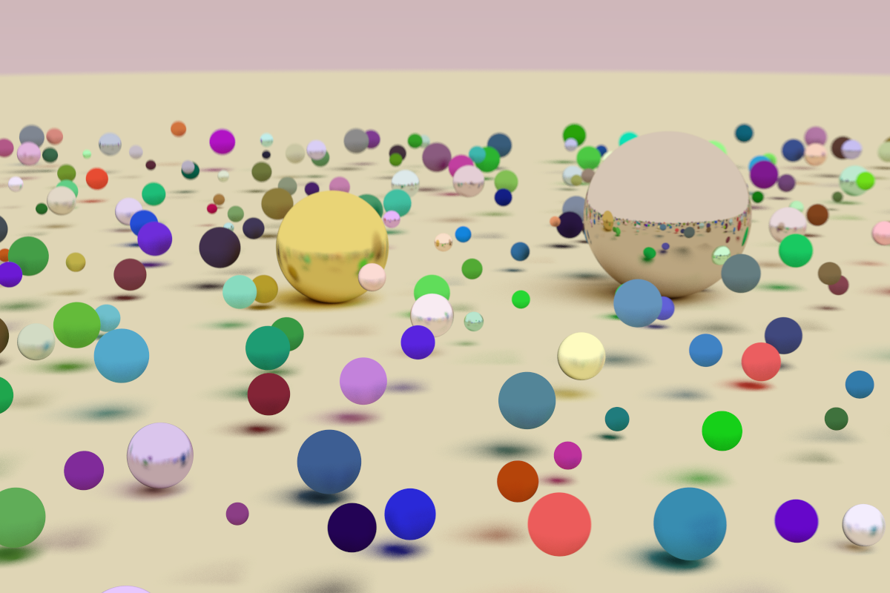
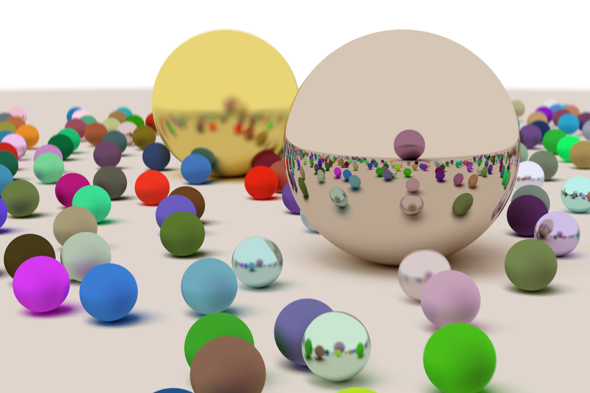

# Raytracer in Rust
A raytracer written in rust.

Implemented Features include: Base ray casting, Matte and Metallic materials, depth of field and anti aliasing.

## Far Away

## Close up

Resouces
 
 - [Raytracing in one weekend](https://raytracing.github.io/books/RayTracingInOneWeekend.html)
